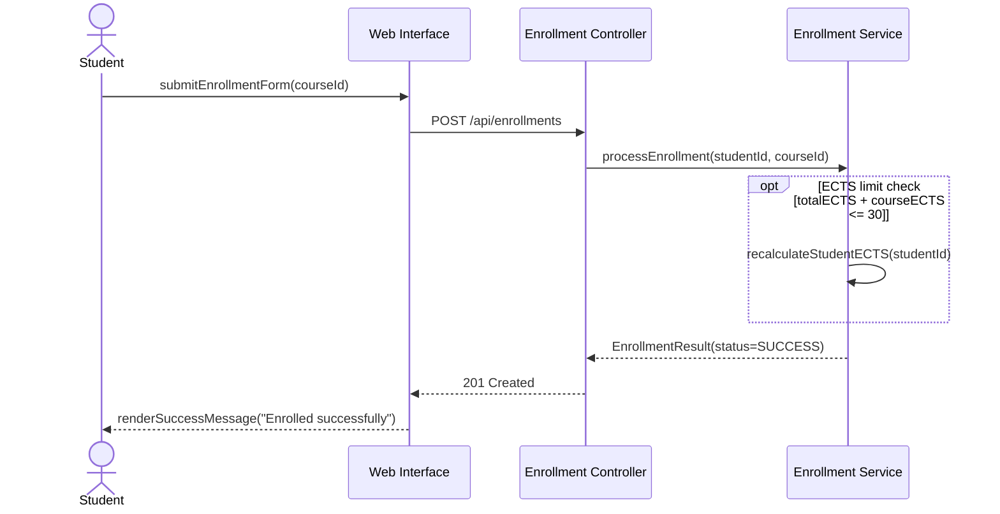
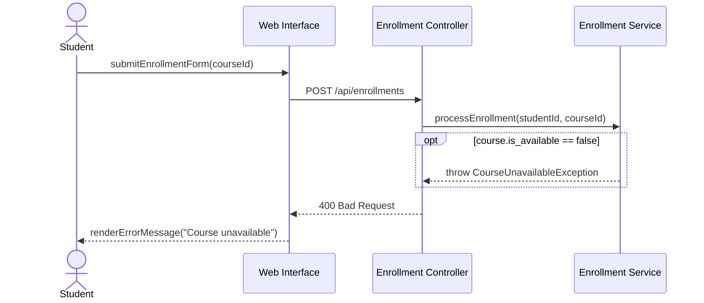
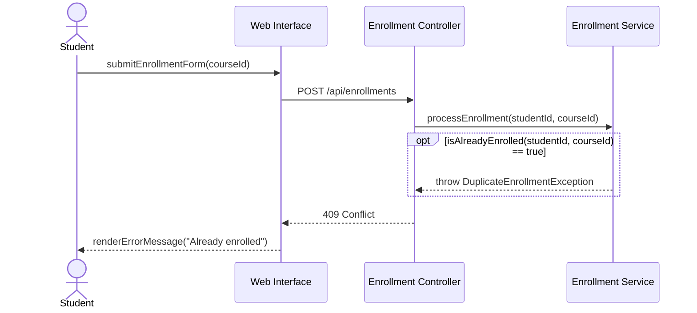
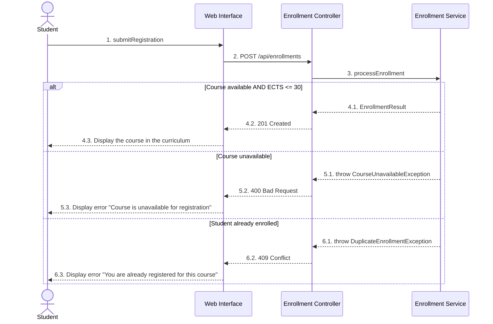

# First diagram

```mermaid
sequenceDiagram
    actor Student as Student
    participant WI as Web Interface
    participant EC as Enrollment Controller
    participant ES as Enrollment Service

    Student->>WI: submitEnrollmentForm(courseId)
    WI->>EC: POST /api/enrollments
    EC->>ES: processEnrollment(studentId, courseId)

    opt ECTS limit check [totalECTS + courseECTS <= 30]
        ES->>ES: recalculateStudentECTS(studentId)
    end

    ES-->>EC: EnrollmentResult(status=SUCCESS)
    EC-->>WI: 201 Created
    WI-->>Student: renderSuccessMessage("Enrolled successfully")
```

# Second diagram

```mermaid
sequenceDiagram
    actor Student as Student
    participant WI as Web Interface
    participant EC as Enrollment Controller
    participant ES as Enrollment Service

    Student->>WI: submitEnrollmentForm(courseId)
    WI->>EC: POST /api/enrollments
    EC->>ES: processEnrollment(studentId, courseId)

    opt course.is_available == false
        ES-->>EC: throw CourseUnavailableException
    end

    EC-->>WI: 400 Bad Request
    WI-->>Student: renderErrorMessage("Course unavailable")
```

# Third diagrams

```mermaid
sequenceDiagram
    actor Student as Student
    participant WI as Web Interface
    participant EC as Enrollment Controller
    participant ES as Enrollment Service

    Student->>WI: submitEnrollmentForm(courseId)
    WI->>EC: POST /api/enrollments
    EC->>ES: processEnrollment(studentId, courseId)

    opt isAlreadyEnrolled(studentId, courseId) == true
        ES-->>EC: throw DuplicateEnrollmentException
    end

    EC-->>WI: 409 Conflict
    WI-->>Student: renderErrorMessage("Already enrolled")
```

# Full diagram

```mermaid
sequenceDiagram
    actor Student as Student
    participant WI as Web Interface
    participant EC as Enrollment Controller
    participant ES as Enrollment Service

    Student->>WI: 1. submitRegistration
    WI->>EC: 2. POST /api/enrollments
    EC->>ES: 3. processEnrollment

    alt Course available AND ECTS <= 30
        ES-->>EC: 4.1. EnrollmentResult
        EC-->>WI: 4.2. 201 Created
        WI-->>Student: 4.3. Display the course in the curriculum
    else Course unavailable
        ES-->>EC: 5.1. throw CourseUnavailableException
        EC-->>WI: 5.2. 400 Bad Request
        WI-->>Student: 5.3. Display error "Course is unavailable for registration"
    else Student already enrolled
        ES-->>EC: 6.1. throw DuplicateEnrollmentException
        EC-->>WI: 6.2. 409 Conflict
        WI-->>Student: 6.3. Display error "You are already registered for this course"
    end
```
