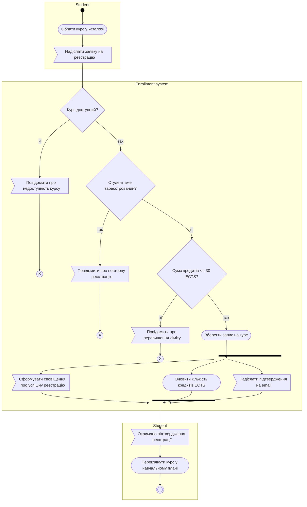

```mermaid
flowchart TD
    subgraph Student["Student"]
        Start(( )) --> SelectCourse(["Обрати курс у каталозі"])
        SelectCourse --> SendReq>"Надіслати заявку на реєстрацію"]
    end

    subgraph System["Enrollment system"]
        SendReq --> CheckAvail{"Курс доступний?"}
        
        CheckAvail -- "ні" --> NotifyUnavail>"Повідомити про недоступність курсу"]
        NotifyUnavail --> End1((X))
        
        CheckAvail -- "так" --> CheckReg{"Студент вже зареєстрований?"}
        
        CheckReg -- "так" --> NotifyDup>"Повідомити про повторну реєстрацію"]
        NotifyDup --> End2((X))
        
        CheckReg -- "ні" --> CheckCredits{"Сума кредитів <= 30 ECTS?"}
        
        CheckCredits -- "ні" --> NotifyLimit>"Повідомити про перевищення ліміту"]
        NotifyLimit --> End3((X))
        
        CheckCredits -- "так" --> SaveCourse(["Зберегти запис на курс"])
        SaveCourse --> ForkStart[" "]
        
        ForkStart --> NotifySuccess>"Сформувати сповіщення про успішну реєстрацію"]
        ForkStart --> UpdateCredits(["Оновити кількість кредитів ECTS"])
        ForkStart --> SendEmail>"Надіслати підтвердження на email"]
        
        NotifySuccess --> ForkEnd[" "]
        UpdateCredits --> ForkEnd
        SendEmail --> ForkEnd
    end

    subgraph Student_End["Student"]
        ForkEnd --> ReceiveConfirm>"Отримано підтвердження реєстрації"]
        ReceiveConfirm --> ViewPlan(["Переглянути курс у навчальному плані"])
        ViewPlan --> Stop((( )))
    end

    %% Стилізація ліній синхронізації (Fork/Join) та початкового вузла
    style ForkStart fill:#000,stroke:#000,height:5px,width:250px
    style ForkEnd fill:#000,stroke:#000,height:5px,width:250px
    style Start fill:#000,stroke:#000
```
